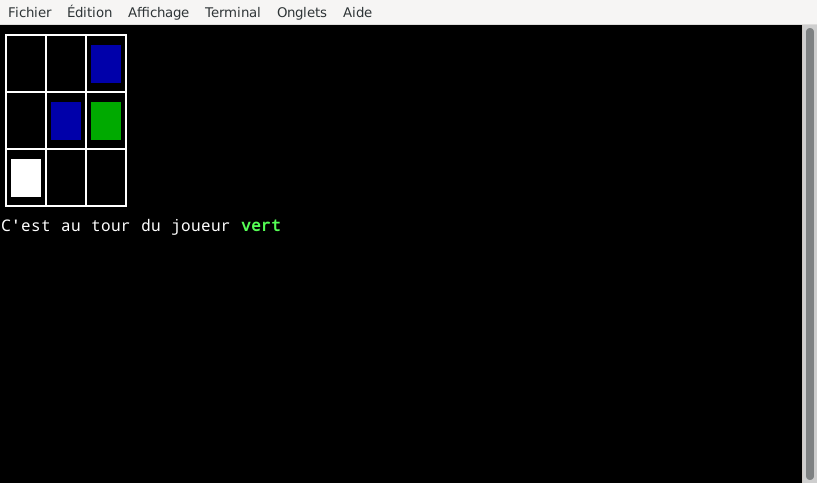

# cli-morpion
A text based tic tac toe game

 
## Compiling
to compile the game use
```
$ make
```
the executable will be in the bin folder  
to clean remove the compilation results, use
```
$ make clean
```

## Usage

run the game with one of these commands
```
$ make run
$ ./bin/cli-morpion
```

## Controls
directional input : arrow keys  
select the current tile : enter  
exit : q